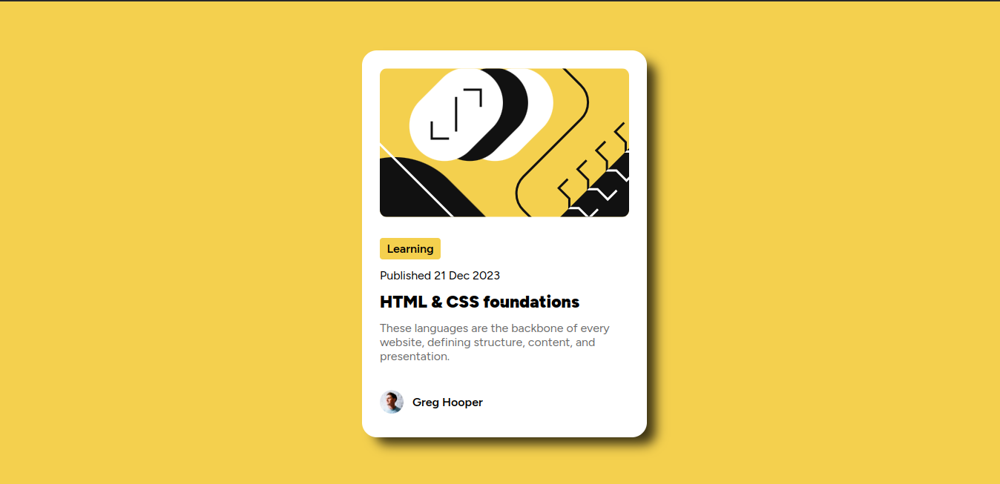

# Frontend Mentor - Blog preview card solution

This is a solution to the [Blog preview card challenge on Frontend Mentor](https://www.frontendmentor.io/challenges/blog-preview-card-ckPaj01IcS). Frontend Mentor challenges help you improve your coding skills by building realistic projects. 

## Table of contents

- [Overview](#overview)
  - [The challenge](#the-challenge)
  - [Screenshot](#screenshot)
  - [Links](#links)
- [My process](#my-process)
  - [Built with](#built-with)
  - [What I learned](#what-i-learned)

## Overview

### The challenge

Users should be able to:

- See hover and focus states for all interactive elements on the page

### Screenshot

### Links

- Solution URL: [Solution URL here](https://github.com/rajin-siam/Blog-preview-card)
- Live Site URL: [Add live site URL here](https://rajin-siam.github.io/Blog-preview-card)

## My process

### Built with

- Semantic HTML5 markup
- CSS custom properties
- Flexbox
- Mobile-first workflow

### What I learned

I am perfecting my flexbox knowledge

## Author

- Website - [Md. Rajin Mashrur Siam](https://rajin-siam.github.io/Portfolio/)
- Frontend Mentor - [@rajin-siam](https://www.frontendmentor.io/profile/yourusername)
- LinkedIn - [md-rajin-mashrur-siam](https://www.linkedin.com/in/md-rajin-mashrur-siam/)

